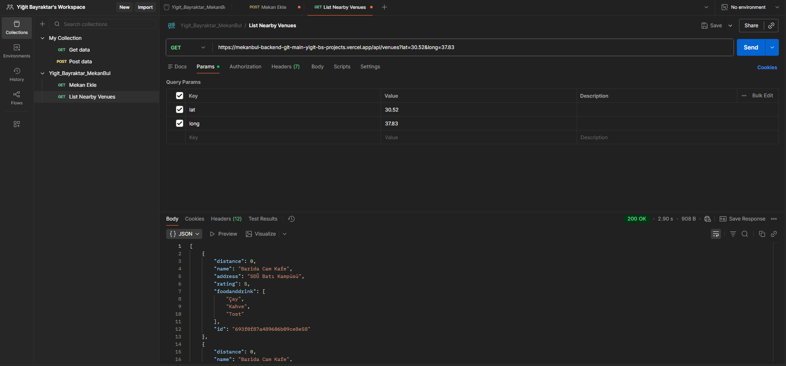
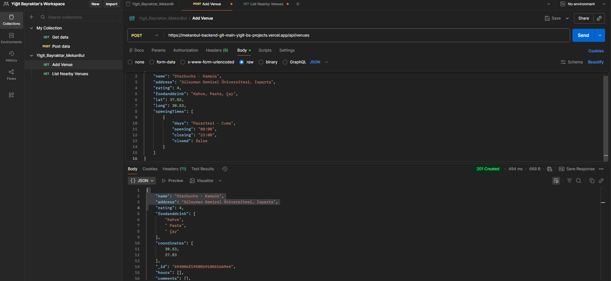
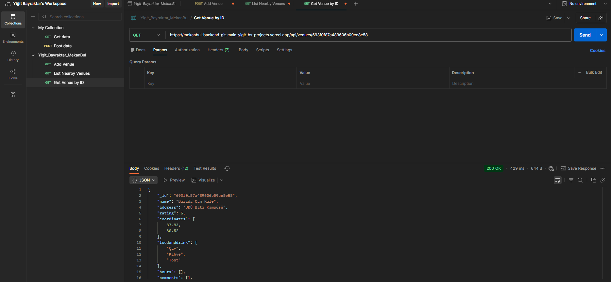
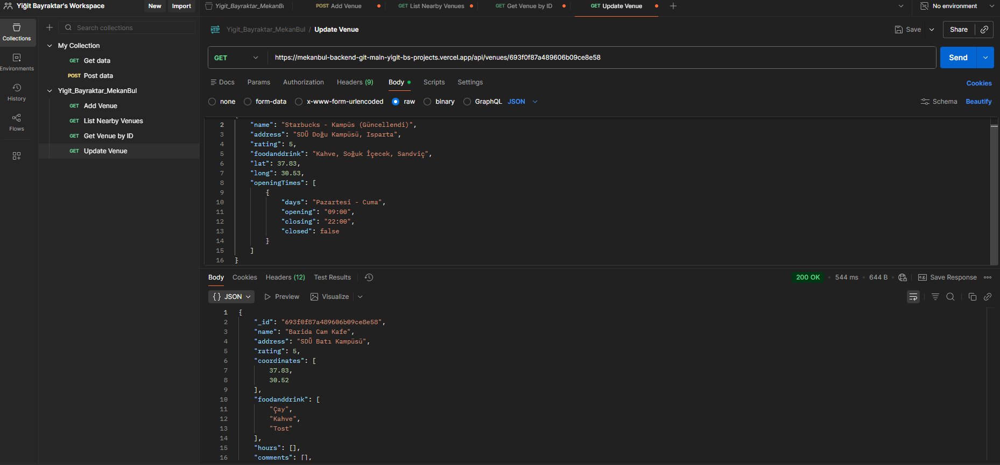
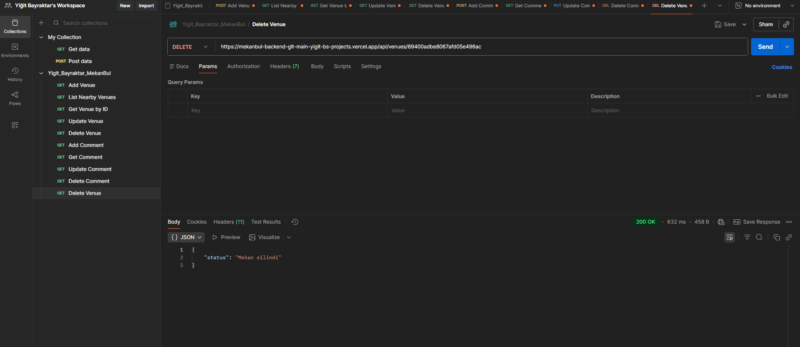
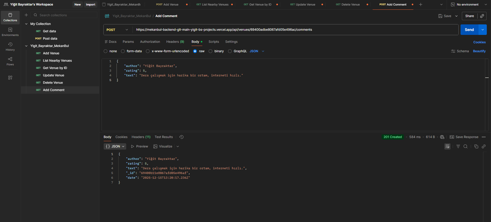
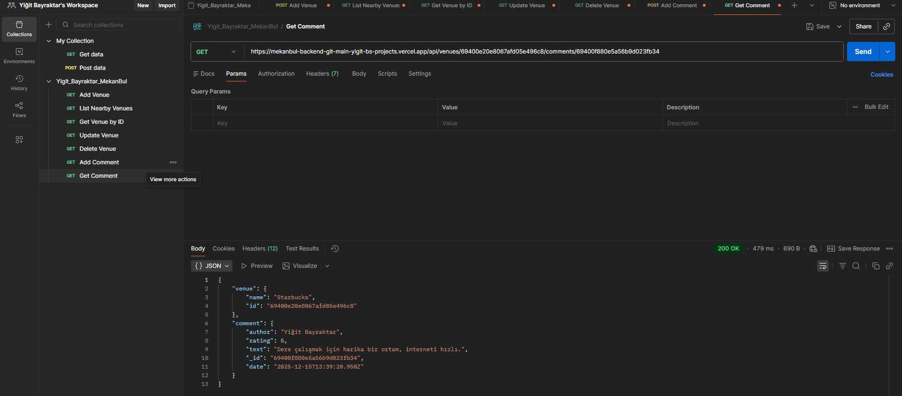
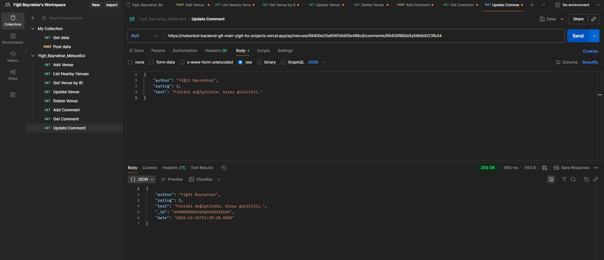
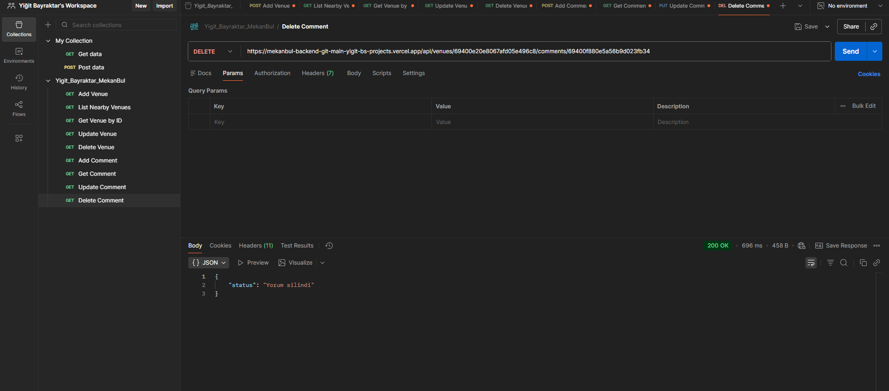

# MekanBul Backend

**Demo:** [https://mekanbul-backend-git-main-yigit-bs-projects.vercel.app](https://mekanbul-backend-git-main-yigit-bs-projects.vercel.app)

Bu proje, **"Web Teknolojileri ve Programlama"** dersi kapsamında geliştirilmiş; mekan verilerinin yönetildiği (CRUD) ve kullanıcıların bu mekanlara yorum yapabildiği RESTful bir API servisidir.

**Geliştirici:** Yiğit Bayraktar
**Ders:** Web Teknolojileri ve Programlama

---

## 🚀 Proje Özellikleri

* **Teknolojiler:** Node.js, Express.js, MongoDB (Mongoose).
* **Mimari:** MVC (Model-View-Controller) yapısına uygun REST API.
* **Mekan Yönetimi:** Ekleme, Listeleme (Konuma göre), Güncelleme, Silme.
* **Yorum Yönetimi:** Mekanlara bağlı alt döküman (Sub-document/Nested) olarak yorum ekleme ve yönetme.

---

## 🛠 Kurulum ve Çalıştırma

Projeyi yerel ortamda test etmek için:

1.  Repoyu klonlayın.
2.  Gerekli paketleri yükleyin:
    ```bash
    npm install
    ```
3.  Projeyi başlatın:
    ```bash
    npm run start
    # Veya nodemon ile:
    nodemon app.js
    ```

---

## 🔌 API Endpoints

Projede kullanılan temel URL adresleri ve HTTP metodları aşağıdadır:

| Metod | Endpoint URI | Açıklama |
| :--- | :--- | :--- |
| `GET` | `/api/venues` | Koordinatlara (enlem, boylam) göre yakındaki mekanları listeler. |
| `POST` | `/api/venues` | Veritabanına yeni bir mekan ekler. |
| `GET` | `/api/venues/:venueid` | ID'si verilen mekanın detaylarını getirir. |
| `PUT` | `/api/venues/:venueid` | Mekan bilgilerini günceller. |
| `DELETE` | `/api/venues/:venueid` | Mekanı siler. |
| `POST` | `/api/venues/:venueid/comments` | Belirtilen mekana yorum ekler. |
| `GET` | `/api/venues/:venueid/comments/:commentid` | Tek bir yorumu getirir. |
| `PUT` | `/api/venues/:venueid/comments/:commentid` | Yorumu günceller. |
| `DELETE` | `/api/venues/:venueid/comments/:commentid` | Yorumu siler. |

---

## 🧪 API Test Sonuçları (Postman Ekran Görüntüleri)

Proje kapsamında geliştirilen tüm endpoint'lerin Postman üzerindeki başarılı test sonuçları aşağıdadır. Ekran görüntüleri `tests` klasöründe yer almaktadır.

### 1. Mekan (Venue) İşlemleri

**Yakındaki Mekanları Listeleme (GET):**
Enlem ve boylam parametrelerine göre mekanları listeler.


**Yeni Mekan Ekleme (POST):**
Veritabanına yeni bir mekan kaydeder.


**Mekan Detayı Getirme (GET - by ID):**
ID'si verilen mekanın detaylarını getirir.


**Mekan Güncelleme (PUT):**
Mevcut mekanın bilgilerini günceller.


**Mekan Silme (DELETE):**
Mekanı veritabanından kaldırır.


### 2. Yorum (Comment) İşlemleri

**Yorum Ekleme (POST):**
Belirli bir mekana yeni yorum ekler (Nested Resource).


**Tek Yorum Getirme (GET):**
Hem Mekan ID hem Yorum ID kullanılarak spesifik bir yorumu getirir.


**Yorum Güncelleme (PUT):**
Yapılan yorumun içeriğini veya puanını günceller.


**Yorum Silme (DELETE):**
Mekana ait yorumu siler.

